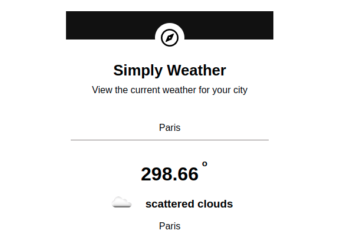

### [Link](https://login-weather.herokuapp.com/)


# Simply Weather

A simple weather application which enable users to get instant alerts regarding weather conditions.




## Tech Stack

**Client:** Ejs, Css, Bootstrap5

**Server:** Node, Express, Axios


## Run Locally

Clone the project

```bash
  git clone gh repo clone subh-23/Weather-app-ExpressJs
```

Go to the project directory

```bash
  cd my-project
```

Install dependencies

```bash
  npm install
```

Start the server

```bash
  npm start
```

